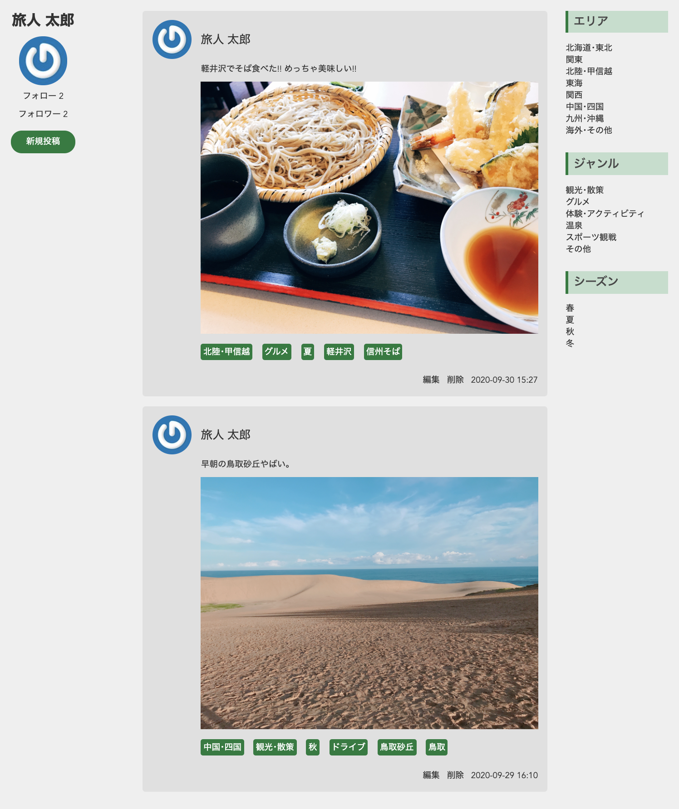

# Tabicolle (タビコレ)

## URL

https://tabicolle.herokuapp.com/

## イメージ図

## 概要

**Tabicolle は､旅行好きたちが旅の思い出のコレクションをシェアし合うサービスです｡**

1. 日記感覚で旅行を記録することで何度でも旅の思い出が蘇ります｡
2. 新しい旅行のプランが見つかります｡

## 使用例

### 週末予定のないとある大学生

>A君:今週末どっか行かない??
>
>B君:いいね｡どっか行こう!!
>
>C君:どこにする??
>
>A君:鳥取砂丘とかどう?? (本アプリの鳥取砂丘のタグがついた投稿を見せる)
>
>B君,C君:そこにしよう!!

## 実装した機能

- ユーザーの新規登録･編集機能(Devise)
- ログイン･ログアウト機能(Devise)
- 旅行記録投稿･編集機能
  - タグ機能(acts-as-taggable-on, エリアタグ,ジャンルタグ,シーズンタグ,フリータグ)
  - 画像アップロード機能(ActiveStorage, AmazonS3)
  - フォロー､フォロワー機能

## 使用技術

### フロントエンド
- HTML/CSS
- Sass(SCSS)
- Bootstrap

### バックエンド
- Ruby : 2.6.6
- Rails : 6.0.3.2

### データベース
- PostgreSQL(本番環境)
- MySQL(開発環境､テスト環境)

### インフラ
- Heroku
- AWS(S3)

### その他ツール
- Github(コード管理)
- [ロゴメーカー](https://logo-maker.stores.jp/)(ロゴ作成ツール)
