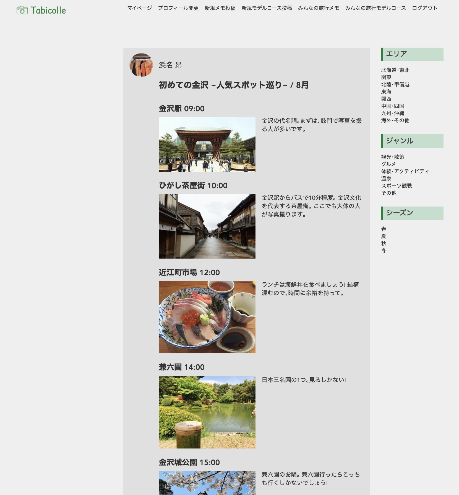

# Tabicolle (タビコレ)

## URL

停止しました

## イメージ図

## 概要

**Tabicolle をつかう、すべての人が貴重な時間を浪費せず､時間を楽しい旅行に出会うことをアプリケーションです。**

1. 日記感覚で旅行を記録することで何度でも旅の思い出が蘇ります｡
2. 新しい旅行のプランが見つかります｡
3. モデルコースを見ることで､当日のイメージが湧きます｡

## 使用例

### 週末予定のないとあるグループ

> A 君:今週末どっか行かない??
>
> B 君:いいね｡どっか行こう!!
>
> C 君:どこにする??
>
> A 君:すなば珈琲行ってみたいし､鳥取砂丘とかどう?? (本アプリの鳥取砂丘のタグがついた投稿を見せる)
>
> > 

> B 君、C 君:そこにしよう!!

### 京都観光している時に次の行くところ､やることが見つかっていないグループ

> A さん:今から､何しようか??
>
> (京都のタグのついた投稿を見る)
>
> 
>
> B さん:清水寺に行ってみたいな!
>
> C さん:いいよ!!
>
> A さん:そうだね!行こう!!

## 実装した機能

- ユーザーの新規登録･編集機能(Devise)
- ログイン･ログアウト機能(Devise)
- Google アカウントでの認証･ログイン機能(omniauth-google-oauth2)
- 旅行記録投稿･編集機能･モデルコース投稿機能
  - タグ機能(acts-as-taggable-on、 エリアタグ、ジャンルタグ、シーズンタグ、フリータグ)
  - 画像アップロード機能(ActiveStorage、 AmazonS3)
  - フォロー､フォロワー機能
  - Ajax でのいいね機能
